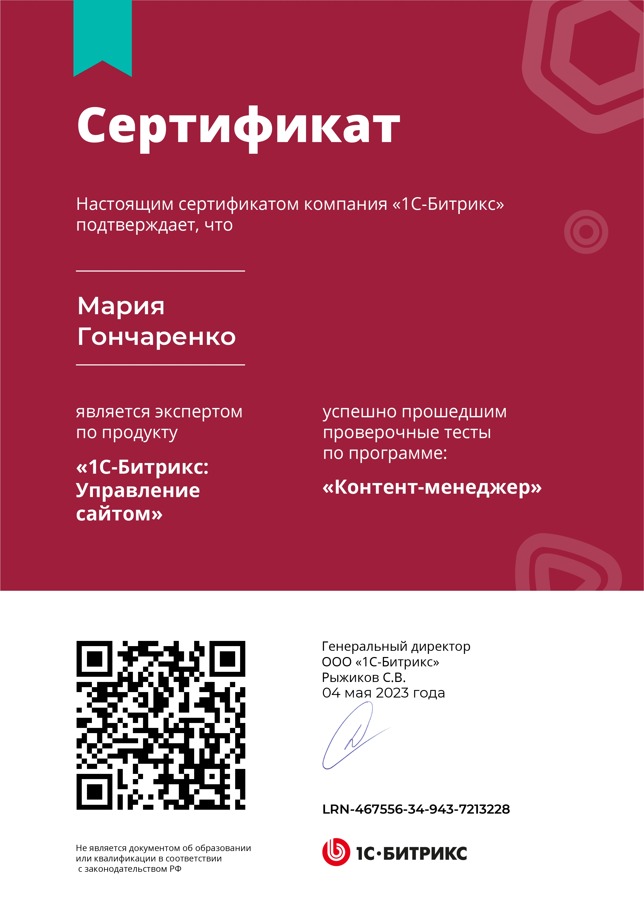
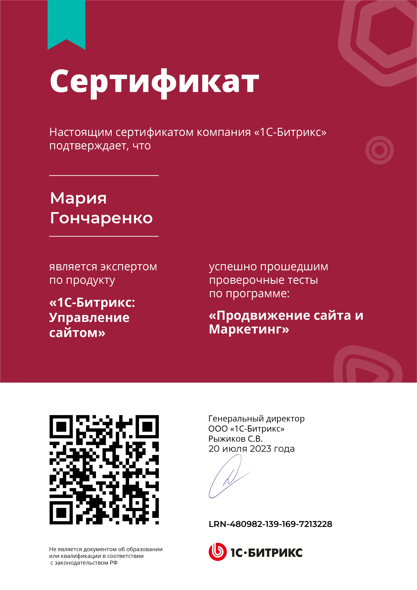
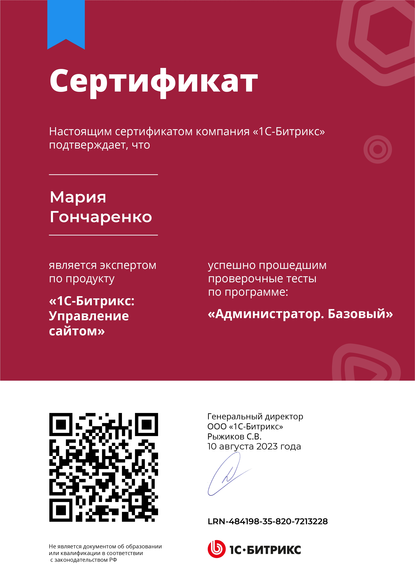
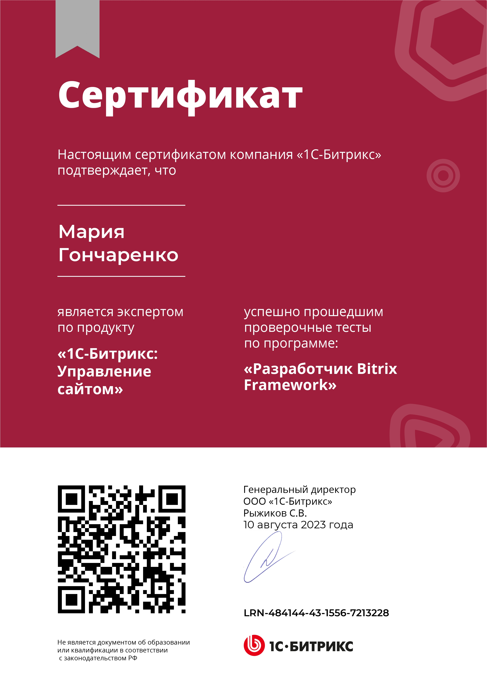

### Привет! 👋

Меня зовут Мария. Занимаюсь веб-разработкой с 2022 года. До этого работала веб-дизайнером на фрилансе.

- 📈 Закончила курс "Веб-разработчик" в Я.Практикуме.
- 🚀 В настоящий момент изучаю PHP, Bitrix Framework, Vue и TypeScript
- 💰 Работаю Fullstack-разработчиком в России.

## Контактная информация:

* Email: Mari.G97@yandex.com
* Telegram: https://t.me/mariya_goncharenko

## Уже понимаю как работать в:

&nbsp;
&nbsp;
&nbsp;
&nbsp;
&nbsp;
&nbsp;
&nbsp; 
&nbsp;

## Статистика моего профиля:

    
    
    

## Сертификаты Яндекс.Практикум:

    

## Сертификаты 1С-Битрикс:

    
    
    
    

## До новых встреч!

  

 
  Просмотров профиля: 
  

