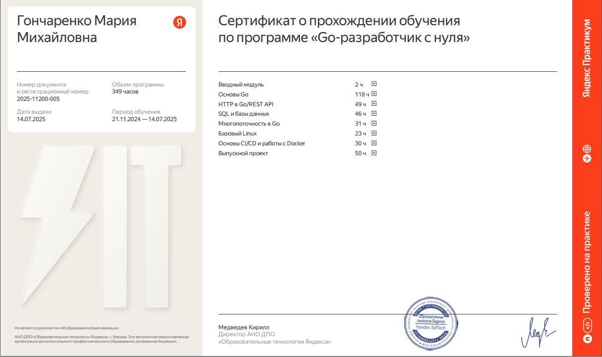
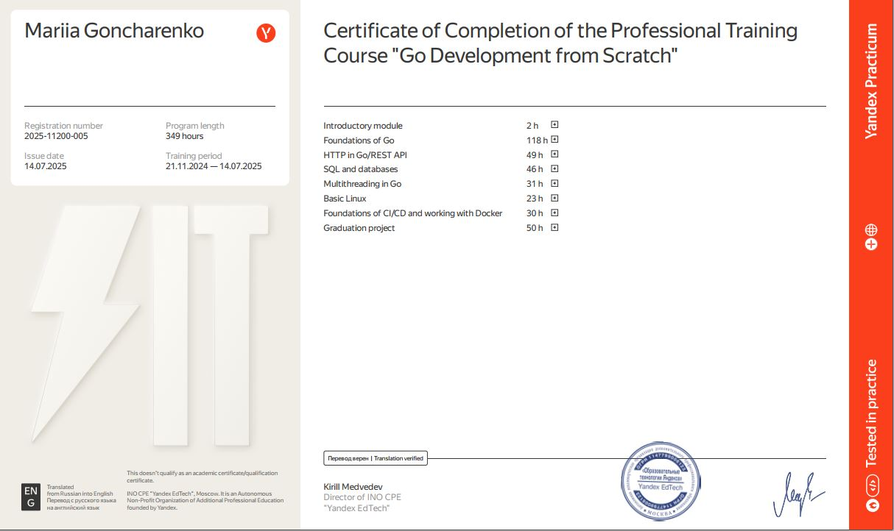
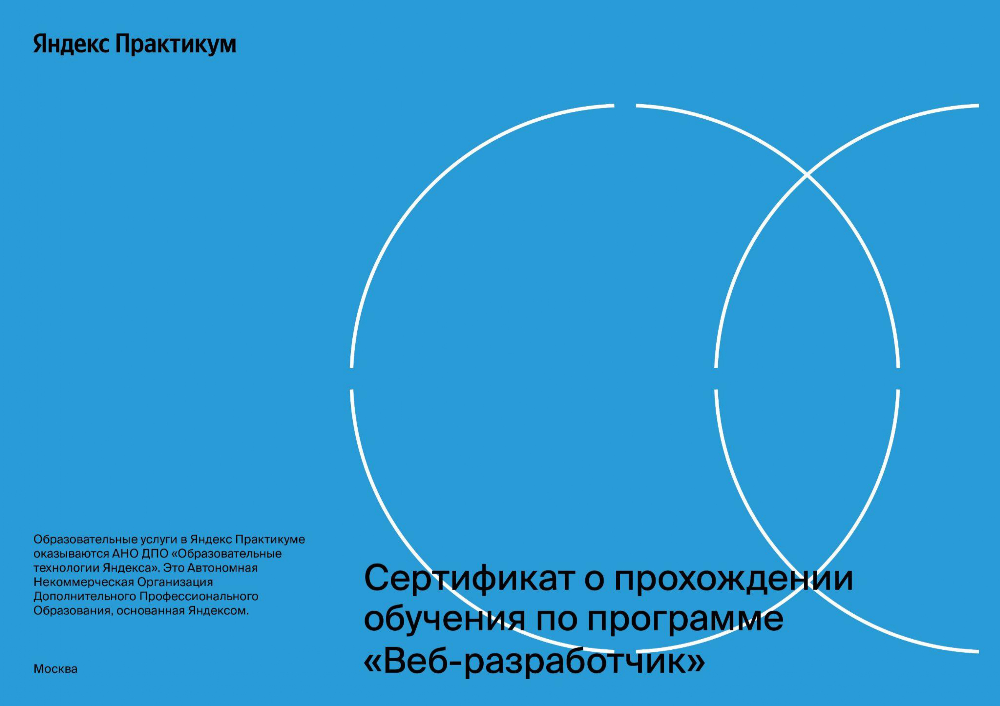

### Привет! 👋

Меня зовут Мария. Занимаюсь веб-разработкой с 2022 года. До этого работала веб-дизайнером на фрилансе.

- 💼 С 2023 года работаю с Bitrix Framework, разрабатываю кастомные модули, интеграции и работаю с множеством API.

- 🚀 В настоящий момент развиваю навыки в Go, PHP, Bitrix Framework, а также продолжаю учить Vue и TypeScript.

- 💰 Работаю Fullstack-разработчиком в России.

- 📈 Закончила курс «Веб-разработчик» в Яндекс.Практикум.

- ⚙️ Освоила язык Go, прошла обучение "Go-разработчик с нуля" в Яндекс.Практикум.

## Контактная информация:

* Email: Mari.G97@yandex.com
* Telegram: https://t.me/mariya_goncharenko

## Статистика моего профиля:

    
    
    

## Сертификаты Яндекс.Практикум:

### Курс "Go-разработчик с нуля":

    
    

### Курс "Веб-разработчик":

    
    

## Сертификаты 1С-Битрикс:

    
    
    
    

## До новых встреч!

  

 

<!--    -->
  
<!--      -->

